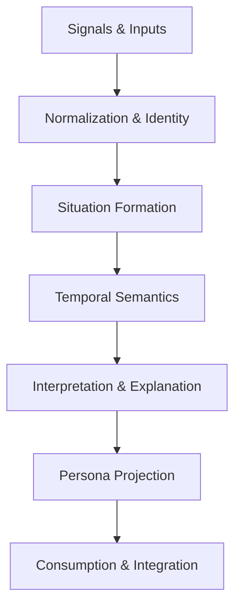

# Architecture Overview

## Purpose of This Document

This document describes the **conceptual technical architecture** of the Situational Intelligence Platform.

It explains:
- the major architectural layers,
- the responsibility boundaries between those layers,
- and the invariants that ensure the system preserves its core principles:
  **horizon awareness, persona relevance, signal integrity, and explainability**.

This document intentionally avoids:
- technology selection,
- infrastructure design,
- deployment topology,
- or implementation detail.

Those topics are covered in dedicated documents linked at the end.

---

## Architectural Philosophy

This architecture is designed to support **orientation, not execution**.

Most security architectures optimize for:
- ingestion speed,
- alert throughput,
- and operational efficiency.

This system optimizes for:
- **meaning over volume**,
- **context over immediacy**,
- **decision alignment over event delivery**.

To achieve this, the architecture is layered by **responsibility**, not by toolchain.

---

## High‑Level Architecture Shape

Each layer has a clearly defined role and explicit non‑goals.

## Architectural Layers

The system is structured as a sequence of **responsibility‑bounded layers**.  
Each layer does *one thing well*, and explicitly refuses to do other things.

This separation is what preserves horizon awareness, persona relevance, and explainability.

---

### 1. Signal Intake Layer

**Primary Responsibility**  
Collect signals from diverse sources **without interpretation, prioritization, or judgment**.

This layer ensures the platform maintains **maximum raw visibility** into the environment before any meaning is imposed.

---

#### What This Layer Does

- Ingests signals from heterogeneous external and internal sources
- Preserves original content, timestamps, context, and provenance
- Accepts duplication and contradiction by design
- Operates continuously and independently of downstream reasoning

Signals entering this layer are treated as **observations about the world**, not decisions or alerts.

---

#### What This Layer Explicitly Does *Not* Do

- Assign severity, urgency, or priority
- Deduplicate or cluster signals
- Filter based on perceived importance
- Suppress signals due to confidence or trust assumptions
- Infer intent, outcome, applicability, or relevance

> **If a decision is made here, the system has already failed.**

---

#### Key Invariants

- Completeness over cleanliness  
- Provenance is always preserved  
- Contradiction is allowed  
- No horizon inference occurs here  

---

#### Downstream Dependency

Feeds directly into:
- **Normalization & Identity Layer**

Has no awareness of:
- situations
- time horizons
- personas
- explanations

---

### 2. Normalization & Identity Layer

**Primary Responsibility**  
Make heterogeneous signals comparable and link them to **stable identities**.

---

#### What This Layer Does

- Normalizes formats and semantics
- Resolves shared identity across sources (e.g., same incident, same vulnerability)
- Preserves conflicting interpretations
- Attaches signals to identity anchors without judgment

---

#### What This Layer Does *Not* Do

- Decide which identity “wins”
- Suppress minority or dissenting interpretations
- Assign urgency or relevance

> **Identity is stable; evidence may disagree.**

---

#### Key Invariants

- Identity is not opinion
- Evidence remains independent
- Disagreement is preserved as data

---

#### Downstream Dependency

Feeds into:
- **Situation Formation Layer**

---

### 3. Situation Formation Layer

**Primary Responsibility**  
Cluster related signals into **situations** representing an underlying reality.

---

#### What This Layer Does

- Groups signals that describe the same phenomenon
- Allows one signal to participate in multiple situations
- Spans multiple signal collections by design
- Maintains uncertainty and partial knowledge

---

#### What This Layer Does *Not* Do

- Rank situations
- Assign urgency
- Decide correctness

> **Situations provide structure without judgment.**

---

#### Key Invariants

- Situation ≠ incident ≠ alert
- Situations may be incomplete
- Multi‑collection participation is expected

---

#### Downstream Dependency

Feeds into:
- **Temporal Semantics Layer**

---

### 4. Temporal Semantics Layer

**Primary Responsibility**  
Apply **time‑aware meaning** to situations.

---

#### What This Layer Does

- Distinguishes near, mid, and far horizons
- Applies decay and momentum
- Tracks acceleration, persistence, and fading relevance
- Makes temporal distance explicit

---

#### What This Layer Does *Not* Do

- Assign persona‑specific importance
- Suppress older signals
- Collapse long‑term patterns

> **Time changes meaning.**

---

#### Key Invariants

- Old certainty is worse than fresh uncertainty
- Horizon is explicit, not inferred
- Relevance evolves continuously

---

#### Downstream Dependency

Feeds into:
- **Interpretation & Explanation Layer**

---

### 5. Interpretation & Explanation Layer (AI)

**Primary Responsibility**  
Explain what a situation **means**, not what action to take.

---

#### What This Layer Does

- Identifies dominant signal roles (early, confirmatory, analytical, narrative)
- Synthesizes explanations across collections and horizons
- Preserves uncertainty, contradiction, and confidence levels
- Produces interpretable narratives

---

#### What This Layer Does *Not* Do

- Prescribe actions
- Hide uncertainty
- Assert false precision

> **Explanation ≠ recommendation.**

---

#### Key Invariants

- Transparency over optimization
- Uncertainty is visible
- Confidence is justified

---

#### Downstream Dependency

Feeds into:
- **Persona Projection Layer**

---

### 6. Persona Projection Layer

**Primary Responsibility**  
Adapt meaning to **decision context**.

---

#### What This Layer Does

- Reframes explanations by persona
- Adjusts emphasis by time horizon
- Applies persona‑specific confidence thresholds
- Maintains a single underlying truth

---

#### What This Layer Does *Not* Do

- Create persona‑specific facts
- Change underlying data
- Override explanations

> **Same truth, different relevance.**

---

#### Key Invariants

- Persona affects framing, not reality
- Horizon awareness is preserved
- No silent personalization

---

#### Downstream Dependency

Feeds into:
- **Consumption & Integration Layer**

---

### 7. Consumption & Integration Layer

**Primary Responsibility**  
Deliver situational intelligence to humans and downstream systems.

---

#### What This Layer Does

- Presents executive briefings
- Produces analyst summaries
- Enables strategic outlooks
- Integrates with external platforms

---

#### What This Layer Does *Not* Do

- Contain business logic
- Automate decisions
- Perform prioritization

> **This layer shows; it never decides.**

---

#### Key Invariants

- Presentation only
- No hidden transformation
- Traceability preserved

---

## Architectural Non‑Goals

This architecture explicitly does **not** attempt to be:

- a SIEM
- an alerting engine
- a ticketing system
- a vulnerability scanner
- a SOAR platform
- a feed aggregator

Those systems execute.  
This system **orients**.

---

## Relationship to Other Documents

This architecture is anchored to the conceptual model defined in:

- 📄 **OVERVIEW.md** — system purpose, horizons, and intent  
- 📄 **COLLECTIONS.md** — question‑driven signal collections  
- 📄 **PERSONAS.md** — decision personas and horizon framing  

---

## Deferred Technical Documents

Implementation details are intentionally deferred to:

- 📄 **INGESTION.md** — intake mechanics and provenance  
- 📄 **MODEL.md** — entities, relationships, and situations  
- 📄 **AI_REASONING.md** — interpretation and uncertainty handling  
- 📄 **DEPLOYMENT.md** — scaling and availability  
- 📄 **GOVERNANCE.md** — trust, integrity, and auditability  

---

## Final Architectural Principle

> **If a technical decision cannot be mapped to a responsibility defined here,  
> it does not belong in the system.**

Orientation comes first. Execution follows.