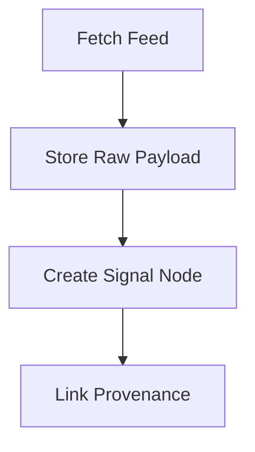
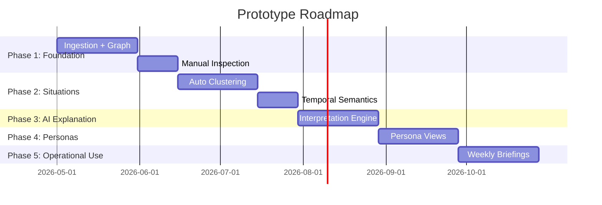

# Prototype Deployment Blueprint
## From Theory to a Working System
This document describes what the prototype looks like in practice:
* concrete components,
* product choices,
* data schema,
* workflows and schedules,
* initial data feeds,
* and a phased roadmap.

It is opinionated, deliberately minimal, and designed to produce a usable prototype without violating the architectural and governance principles already defined.

### 1. High‑Level System Shape (Concrete)

```mermaid
flowchart LR
    Feeds["External & Internal Feeds"]
    Ingest["Ingestion Jobs"]
    Normalize["Normalize & Identity"]
    Situations["Situation Builder"]
    Temporal["Temporal Semantics"]
    AI["AI Explanation"]
    Persona["Persona Projection"]
    Output["Briefings & Views"]

    Feeds --> Ingest
    Ingest --> Normalize
    Normalize --> Situations
    Situations --> Temporal
    Temporal --> AI
    AI --> Persona
    Persona --> Output
```


Key properties enforced in code:
* no ingestion logic bleeds into reasoning
* situations exist before urgency
* AI never writes “truth”, only interpretations

### 2. Core Components & Suggested Products

  These are prototype defaults, not permanent commitments.

#### Orchestration
* Apache Airflow
  * explicit DAGs
  * visible schedules
  * replayable runs
  *suitable for audit and governance

#### Graph Store (Core Semantic Layer)
* Neo4j (Community Edition)
  * entities
  * signals
  * situations
  * contradiction & provenance

Why graph first:
* ambiguity
* many‑to‑many relationships
* evolving hypotheses

#### Raw Signal Store
* PostgreSQL (JSONB) or object storage
  * original signal payloads preserved
  * never mutated
  * graph only references metadata

#### AI Reasoning
* LLM (API‑based, pluggable)
  * used only for:
    * explanation
    * contradiction articulation
    * persona framing
* no model training in prototype
* prompts versioned and reviewed

#### Presentation
* Markdown artifacts
  * weekly briefing
  * monthly outlook
* later: minimal read‑only web view

Dashboards come later; narrative comes first.

### 3. Data Schema (Prototype‑Grade)
#### Entities (Stable)
```
Entity:
  entity_id
  type: vulnerability | product | organization | regulation | campaign
  name
  attributes: JSON
```
Entities never decay and never carry urgency.

--

#### Signals (Evidence)
```
Signal:
  signal_id
  source_name
  source_type
  observed_at
  published_at
  collection
  role_hint
  raw_payload_ref
```
Rules:
* immutable
* contradictions allowed
* duplicates expected

---

#### Situations (Hypotheses)
```
Situation:
  situation_id
  title
  summary
  created_at
  last_updated
```
Situations:
* may be wrong
* may change
* never deleted

---

#### Interpretations (Versioned)
```
Interpretation:
  interpretation_id
  situation_id
  horizon: near | mid | far
  explanation_text
  uncertainty_notes
  assumptions
  created_at
```
Interpretations are append‑only.

---

#### Persona Views
```
Persona_View:
  interpretation_id
  persona
  framing
  emphasis
```
Same reality, different framing.

---

### Workflows & Schedules
Ingestion DAGs

| Feed Type | Schedule |
| ------------| --------------|
| ISAC alerts | hourly |
| Vendor advisories | daily |
| CVE / NVD | daily |
| Regulatory sources | daily |
| Media & narrative | 6–12h |

#### Situation Builder
* runs every 6–12 hours
* clusters by:
  * shared entities
  * semantic similarity
  * temporal proximity
* never applies severity

#### Temporal Semantics
* runs daily
* annotates:
  * decay
  * momentum
  * persistence
* no deletion of signals or situations

#### AI Explanation
Trigger conditions:
* new situation
* material signal added
* contradiction introduced

Output:
* explanation
* explicit uncertainty
* no recommendations

#### Persona Projection
* on demand or scheduled
* consumes interpretations
* produces persona‑specific framing only


### 5. Initial Data Feeds (Minimal but Sufficient)
#### Technical
* NVD CVE feed
* 1–2 major vendor advisory feeds
* exploit PoC monitoring (GitHub / blogs)

#### Incident / Breach
* public disclosure aggregators
* ransomware leak metadata (no files)

#### Regulatory
* one privacy / cyber regulator
* consultation drafts + enforcement notices

#### Narrative
* 1–2 sector‑relevant journalism sources

#### Human / Organizational
* public layoffs
* staffing stress reporting
* organizational statements

This is intentionally small but cross‑domain.

### 6. Weekly & Monthly Outputs
#### Weekly Brief (Auto‑Generated)
* near‑field situations
* emerging controversies
* confidence changes

#### Monthly Outlook
* mid‑field patterns
* governance risk
* trajectory changes

#### Quarterly (Later)
* far‑field shifts
* trust erosion
* structural risk

### 7. Prototype Roadmap

### 8. What “Working” Looks Like
The prototype is successful when:
* situations exist before urgency
* contradictions are visible
* explanations cite uncertainty
* personas receive different framing
* leaders stop asking for “the dashboard”
* weekly briefings replace manual synthesis

Performance metrics are secondary.

### Final Engineering Guidance
If you feel pressure to:
* filter earlier,
* auto‑prioritize,
* or collapse ambiguity,

**pause.**

Those are signals you are re‑building the system this project exists to replace.